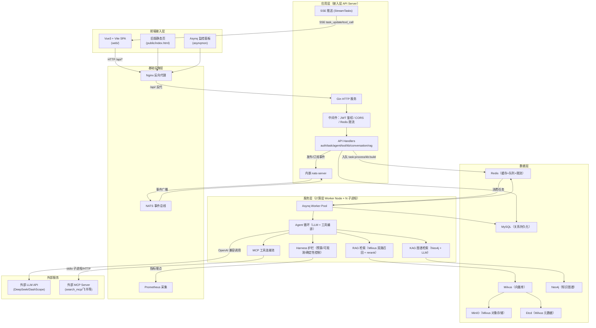
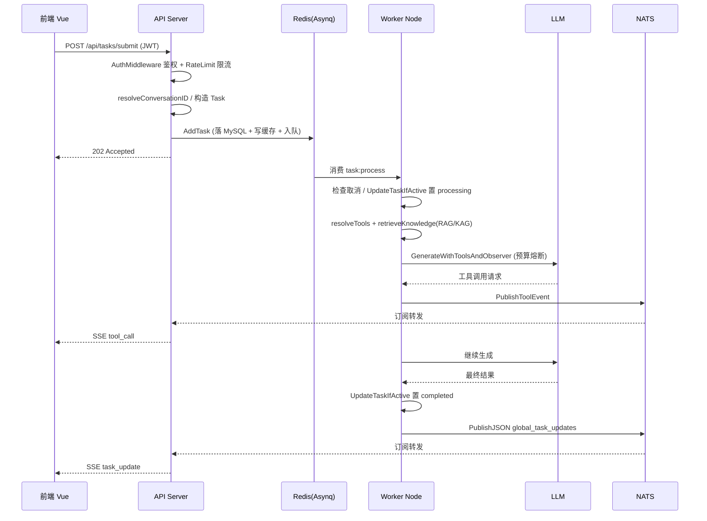
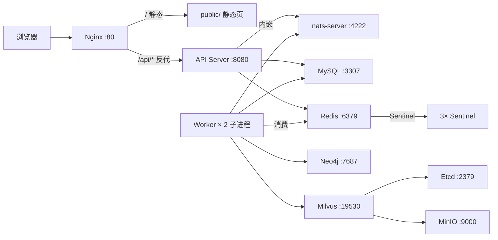

# GoTaskAI 系统技术文档

> 本文档系统性梳理 GoTaskAI 项目从底层基础设施到上层应用的全部实现细节，覆盖业务定位、技术选型、模块设计、数据层、部署运维与核心技术难点。
> 面向新研发成员快速上手与后续架构迭代，所有描述与当前代码/配置保持一致。

---

## 目录

1. [项目概述](#1-项目概述)
2. [整体技术架构](#2-整体技术架构)
3. [模块详细设计](#3-模块详细设计)
4. [数据层设计](#4-数据层设计)
5. [部署运维体系](#5-部署运维体系)
6. [核心技术难点与解决方案](#6-核心技术难点与解决方案)
7. [附录](#7-附录)

---

## 1. 项目概述

### 1.1 业务背景与核心目标

GoTaskAI 是一个**异步 AI 任务调度与 GraphRAG 对话平台**，解决三类真实业务问题：

1. **私有知识盲区**：通用大模型只懂常识、不懂企业私有知识。平台通过 RAG（向量检索）+ KAG（知识图谱检索）双路召回，让模型能引用企业内部文档与关系知识作答。
2. **"光说不做"**：通用大模型只会生成文本、无法执行外部动作。平台通过 MCP 工具平台为模型挂载外部工具（联网搜索、飞书等），赋予其 Agent 能力。
3. **调用慢、并发低**：大模型调用耗时长、易阻塞。平台通过「接入层/计算层」进程拆分 + Asynq 消息队列实现削峰填谷，接口秒级返回。

核心目标是打造一个「**私有知识 + 大模型 + 外部工具**」的多维可配置 Agent 平台，让同一套后端服务不同风格的智能体。

### 1.2 目标用户与使用场景

- **企业知识问答**：员工上传文档建知识库，创建 Agent 绑定知识库后提问，平台自动检索知识作答。
- **任务执行**：用户向 Agent 派发任务，Agent 调用工具（如联网搜索）执行并实时反馈进度。
- **工具集成**：用户注册并绑定外部 MCP 工具，扩展 Agent 能力边界。

### 1.3 核心功能边界

**已实现（In scope）**

- 用户认证（注册/登录/找回密码）
- Agent 管理（增删改查、运行、工具白名单绑定、知识库绑定、模型级覆盖）
- 知识库管理（创建/删除、文档上传与异步入库、RAG/KAG 双路检索）
- 工具管理（注册/编辑/启停/测试/发现/绑定反查，MCP 协议接入）
- 会话管理（多轮对话、上下文自动压缩）
- 任务管理（提交/查询/列表/删除/重试/取消、SSE 实时推送）
- Agent Harness 工程化护栏（验证循环、成本熔断、可观测、确定性控制、渐进披露、评估 harness）

**未实现（Out of scope）**

- 多租户组织/团队模型（当前仅有单用户 `user_id` 归属）
- 计费系统（`CostUSD` 仅为观测计量，无账单）
- 基于输出的结构化 Schema 强校验（Task/Agent 无输出表达字段，见 §6.2 技术债）

### 1.4 非功能性需求

| 维度 | 要求 | 实现方式 |
|---|---|---|
| 性能 | 接口快速返回、高并发削峰 | API 秒回 202 + Asynq 队列异步消费 |
| 可用性 | 关键链路高可用 | Redis Sentinel（1主2副本3哨兵）、限流 fail-open、工具/检索降级回退 |
| 可扩展性 | 计算层独立扩容 | Worker 多子进程 supervisor + 多 worker 并发 |
| 可观测性 | 运行可回溯、可告警 | RunLog/ToolCallLog 落表 + Prometheus 指标 + `/metrics` |
| 安全性 | 无状态鉴权、数据隔离 | JWT（HS256）+ bcrypt + 资源归属校验 |
| 成本可控 | 单任务成本有上限 | 预算熔断（单次/跨重试双上限 + token 计量 + CostUSD） |

---

## 2. 整体技术架构

### 2.1 分层架构图

### 2.2 各层核心作用与选型依据

| 层 | 核心作用 | 核心技术 | 选型依据 |
|---|---|---|---|
| 前端接入层 | 用户交互、实时状态展示 | Vue3 + Vite | 轻量 SPA，无路由/状态库，适合演示与快速迭代 |
| 应用层（API Server） | 接请求、鉴权、限流、任务入队、SSE 推送 | Gin | 高性能 HTTP 框架，中间件生态成熟 |
| 服务层（Worker Node） | 消费任务、RAG/KAG 检索、工具编排、LLM 调用 | Asynq + 自研 Agent 循环 | 计算密集与 IO 密集分离，独立扩容 |
| 数据层 | 持久化、缓存、向量检索、图谱 | MySQL/Redis/Milvus/Neo4j | 各司其职：关系数据、缓存队列、向量语义、关系推理 |
| 基础设施层 | 服务编排、代理、事件、监控 | Docker/Nginx/NATS/Prometheus | 容器化部署 + 跨进程事件解耦 |

### 2.3 层间交互协议与通信流程

- **HTTP**：前端 ↔ API Server（REST + SSE）。
- **Asynq（基于 Redis）**：API → Worker 的任务投递（`task:process`、`kb:build` 两队列）。
- **NATS**：Worker → API 的跨进程实时事件（`global_task_updates`、`global_tool_events`、`global_task_cancel`）。
- **gRPC**：仅 Milvus SDK 内部使用（Milvus 客户端连接），非业务控制通道。

### 2.4 核心流程时序图

---

## 3. 模块详细设计

### 3.1 接入层（cmd/api + internal/api）

**职责**：接收 HTTP 请求，鉴权、限流，任务/Agent/工具/知识库/会话的 CRUD，SSE 推送。

**核心入口** [main.go](file:///d:/Program%20Files/GoTaskAI/cmd/api/main.go)：

- 初始化配置 → MySQL → Redis → NATS（内嵌 server）→ TaskManager → 种子内置工具 → 会话回填 → KAG → 各 Handler。
- `AutoMigrate` 注册 11 个模型建表。
- 路由分组见附录 A。

**核心 Handler** [handler.go](file:///d:/Program%20Files/GoTaskAI/internal/api/handler.go)：

- `SubmitTask`：解析请求 → 解析会话 → 构造 Task（`MaxRetry=3`、`Status=pending`、`TraceID`）→ `AddTask` → 返回 202。
- `CancelTask`：`CancelTaskIfActive` 原子条件取消 + `PublishTaskCancel` 广播。
- `StreamTasks`：SSE 长连接，订阅 `Subscribe`/`SubscribeToolEvents`，推送 `task_update`/`tool_call`。

### 3.2 中间件（internal/middleware）

| 中间件 | 职责 | 关键逻辑 |
|---|---|---|
| [auth.go](file:///d:/Program%20Files/GoTaskAI/internal/middleware/auth.go) | JWT 鉴权 | 解析 `Bearer` Token → `c.Set("userID", ...)` |
| [cors.go](file:///d:/Program%20Files/GoTaskAI/internal/middleware/cors.go) | 跨域 | 反射 Origin，OPTIONS 返回 204 |
| [ratelimit.go](file:///d:/Program%20Files/GoTaskAI/internal/middleware/ratelimit.go) | 限流 | Redis `INCR`+`EXPIRE` 固定窗口，fail-open |

### 3.3 任务管理器（internal/queue/manager.go）

**职责**：任务持久化、缓存、入队、事件发布、CAS 写回、计量累计。

**核心方法**：

- `AddTask`：落 MySQL → 写缓存 → `Enqueue`（`asynq.MaxRetry(3)`）。
- `UpdateTaskIfActive`：CAS 条件写回 `WHERE status NOT IN ('cancelled','completed')`。
- `CancelTaskIfActive`：`WHERE status IN ('pending','processing')` 才置 cancelled。
- `AccumulateTaskUsage`：`gorm.Expr` 原子累加 + `rdb.Del` 失效缓存。
- `PublishTaskCancel` / `SubscribeTaskCancel`：取消广播。
- `EnqueueKBBuild`：`asynq.MaxRetry(3)` 收口。
- `GetConversationCompressState` / `SaveConversationSummary`：滚动摘要持久化。
- `GetDocumentSummaries`：文档摘要层查询。

### 3.4 Worker 池（internal/worker/pool.go）

**职责**：消费队列任务，组装 Agent 上下文，执行 Agent 循环，回写状态，埋点观测。

**核心流程**（`handleTaskProcess`）：

1. 解析 payload → 检查取消 → `UpdateTaskIfActive` 置 processing。
2. `resolveTools` 按 Agent 白名单加载工具。
3. 构造预算（`MaxCalls/MaxTotalCalls/单价` + `SetBase`）。
4. 组装 systemPrompt（人设 + 强制搜索指令 + RAG + KAG）。
5. `retrieveKnowledge` 渐进式披露检索。
6. `loadConversationHistory` 会话历史 + 滚动摘要压缩。
7. 可取消 ctx 派生 + in-flight 注册。
8. `GenerateWithToolsAndObserver` 执行 Agent 循环。
9. 预算耗尽置 failed（不可重试）；错误按 `MaxRetry` 重试；成功 CAS 写回 completed。

**关键子方法**：

- `normalizeScores` / `chunkByScore` / `truncateChunk`：RAG 渐进披露。
- `collectDocSummaries`：摘要层注入。
- `retrieveTopDocs`：双路召回 + rerank。
- `saveRunLog`：计量累计 + Prometheus 埋点 + RunLog 落表。
- `handleKBBuild`：分块 → 生成 per-doc 摘要 → embedding → Milvus 写入。

### 3.5 LLM 客户端（internal/pkg/llm）

| 文件 | 职责 |
|---|---|
| [client.go](file:///d:/Program%20Files/GoTaskAI/internal/pkg/llm/client.go) | OpenAI 兼容客户端、Agent 循环、工具编排、Schema 校验、token 估算、摘要/相关性 |
| [budget.go](file:///d:/Program%20Files/GoTaskAI/internal/pkg/llm/budget.go) | 成本预算对象（单次/跨重试双上限 + token 计量 + CostUSD） |
| [embedder.go](file:///d:/Program%20Files/GoTaskAI/internal/pkg/llm/embedder.go) | DashScope 向量化器（独立 embedding 端点） |

**Agent 循环**（`generateWithClient`）：

- `for` 循环：`budget.BeforeCall()` → 请求 LLM → `budget.Record(usage)`。
- 工具调用：参数解析失败/`json.Unmarshal` 失败 → tool 错误消息回传（不再静默）；Schema 校验非法 → 回传自修正；执行工具 → tool 消息回传。
- 无 tool_calls 时返回最终内容。

**关键方法**：

- `GenerateWithToolsAndObserver`：Agent 级覆盖 model/api_key/base_url。
- `GenerateWithToolsAndObserverSampling`：评测固定采样。
- `CompressHistory`：对话历史压缩为摘要。
- `SummarizeText`：文档摘要（kb:build 摘要层）。
- `IsContextRelevant`：KAG 关联度过滤。
- `EstimateTokens` / `EstimateMessagesTokens`：token 估算（CJK 按字、其他按 4 字符）。

### 3.6 RAG 检索（internal/pkg/ragstore）

**职责**：Milvus 向量库封装，双路召回（dense COSINE + sparse BM25）+ RRF 融合。

**Schema**（[schema.go](file:///d:/Program%20Files/GoTaskAI/internal/pkg/ragstore/schema.go)）：Collection `kb_chunks`，字段 `chunk_id/kb_id/doc_id/text/dense/sparse`；dense 用 HNSW（COSINE），sparse 用 SPARSE_INVERTED（IP）。

**BM25**（[bm25.go](file:///d:/Program%20Files/GoTaskAI/internal/pkg/ragstore/bm25.go)）：`tokenPos` 用 FNV-1a 哈希映射词元位置；`buildDocumentSparse` 生成 BM25 词频饱和权重；`filterExpr` 按 `kb_id` 过滤。

**检索**（[store.go](file:///d:/Program%20Files/GoTaskAI/internal/pkg/ragstore/store.go)）：dense + sparse 双路各取 2×topK，RRF 融合收敛到 topK。

### 3.7 KAG 图谱（internal/pkg/kag）

**职责**：基于 Neo4j + LLM 的实体关系抽取、入库与图查询。

**核心方法**（[kag.go](file:///d:/Program%20Files/GoTaskAI/internal/pkg/kag/kag.go)）：

- `ExtractKnowledge`：LLM 抽取 `[{"source","relation","target"}]` 三元组。
- `IngestGraph`：`MERGE` 幂等写入 Neo4j。
- `RetrieveGraphContext`：LLM 生成 Cypher（Text2Cypher）→ 执行 → 取 topN 结果。

### 3.8 重排（internal/pkg/rerank）

**职责**：基于本地 Ollama 的 cross-encoder 相关度重排。

**核心**（[rerank.go](file:///d:/Program%20Files/GoTaskAI/internal/pkg/rerank/rerank.go)）：逐条调用 Ollama `generate` 让 rerank 模型（qwen3-reranker）输出相关性分数，稳定排序取 topN；失败回退 0 分沉底。

### 3.9 MCP 工具平台（internal/pkg/mcpclient + toolregistry + tools/search_mcp）

**四层设计**：

1. **统一抽象**（[toolregistry/tool.go](file:///d:/Program%20Files/GoTaskAI/internal/pkg/toolregistry/tool.go)）：`Tool` 接口（`Name/Description/ToOpenAITool/Execute`）+ `Registry` 注册表。
2. **内置工具**（[toolregistry/builtin.go](file:///d:/Program%20Files/GoTaskAI/internal/pkg/toolregistry/builtin.go)）：`get_current_time`。
3. **MCP 适配**（[toolregistry/mcp.go](file:///d:/Program%20Files/GoTaskAI/internal/pkg/toolregistry/mcp.go)）：`MCPServerTool` 把 MCP 工具适配为 `Tool`。
4. **连接池**（[mcpclient/pool.go](file:///d:/Program%20Files/GoTaskAI/internal/pkg/mcpclient/pool.go)）：按 id 缓存 `Wrapper`，stdio/HTTP 双传输，懒加载复用。

**搜索工具**（tools/search_mcp）：SerpApi 联网搜索，注册为 `internet_search` 工具。

### 3.10 事件总线（internal/events）

**职责**：NATS 封装，API 内嵌 server，Worker 客户端接入。

**主题**（[events.go](file:///d:/Program%20Files/GoTaskAI/internal/events/events.go)）：

- `global_task_updates`：任务状态更新。
- `global_tool_events`：工具调用过程事件。
- `global_task_cancel`：任务取消控制指令。

### 3.11 可观测（internal/metrics + RunLog/ToolCallLog）

**Prometheus 9 组指标**（[metrics.go](file:///d:/Program%20Files/GoTaskAI/internal/metrics/metrics.go)）：任务耗时/次数/重试、LLM 调用/token/成本（按队列）、工具调用、kb:build、压缩尝试/失败率。

**观测表**：`RunLog`（运行级计量）、`ToolCallLog`（工具级调用），均带 `trace_id` 透传。

### 3.12 评估 harness（internal/eval）

**职责**：对评测用例做固定采样、多次独立运行，输出统计稳定报告。

**核心**（[eval.go](file:///d:/Program%20Files/GoTaskAI/internal/eval/eval.go)）：

- `Case{Question, ExpectedTools, ExpectedAnswer}`。
- `Runner.runCase`：N 次运行 → `stats`（均值/方差/CI 半宽裁剪）。
- `cosineSimilarity`：答案语义相似度。
- `EmbeddingErrors` 单列，不静默记 0 分。
- [cmd/eval/main.go](file:///d:/Program%20Files/GoTaskAI/cmd/eval/main.go)：`-threshold` 退出码 CI 闸门。

### 3.13 Harness 工程化护栏（六项目标）

详见 [harness工程优化-实现记录.md](./harness工程优化-实现记录.md)，六项目标均已落地：验证循环、成本熔断、可观测、确定性控制、渐进披露、评估 harness。

---

## 4. 数据层设计

### 4.1 关系型数据库（MySQL）

使用 GORM，表名默认复数蛇形命名。无显式外键/关联标签，关联通过普通索引 + 手动中间表表达。

| 表 | 关键字段 | 索引 | 说明 |
|---|---|---|---|
| `users` | id, username, password, created_at | 主键 id；唯一 username | 密码 bcrypt 哈希，JSON 序列化隐藏 |
| `agents` | id, user_id, name, system_prompt, model, api_key, base_url, status | 主键 id；索引 user_id, status | Agent 可复用配置，支持模型级覆盖 |
| `tools` | id, user_id, name, type, display_name, description, config, is_builtin, status | 主键 id；唯一 name；索引 user_id, status | config 为 JSON（MCP 连接配置） |
| `knowledge_bases` | id, user_id, name, description, type, status, doc_count | 主键 id；索引 user_id, status | type: rag/kag/hybrid |
| `agent_tools` | agent_id, tool_id | 复合主键 (agent_id, tool_id) | Agent↔工具白名单多对多 |
| `agent_knowledges` | agent_id, knowledge_base_id | 复合主键 (agent_id, knowledge_base_id) | Agent↔知识库多对多 |
| `documents` | id, kb_id, title, content, summary, status, chunk_count | 主键 id；索引 kb_id | summary 为构建期摘要层 |
| `conversations` | id, user_id, agent_id, title, summary, summary_cutoff | 主键 id；索引 user_id, agent_id | 滚动摘要 + cutoff |
| `tasks` | id, trace_id, user_id, session_id, conversation_id, agent_id, type, system_prompt, priority, payload, result, status, error, retries, max_retry, total_calls, total_tokens_in, total_tokens_out | 主键 id；索引 trace_id, user_id, session_id, conversation_id, agent_id, status, created_at | 累计计量字段用于跨重试熔断 |
| `run_logs` | id, task_id, trace_id, user_id, agent_id, model, status, calls, tokens_in, tokens_out, cost_usd, duration_ms, error | 主键 id；索引 task_id, trace_id, user_id, agent_id, status | 运行观测 |
| `tool_call_logs` | id, task_id, trace_id, user_id, agent_id, tool_name, arguments, status, result, error | 主键 id；索引 task_id, trace_id, user_id, agent_id, tool_name | 工具观测 |

### 4.2 非关系型存储

| 存储 | 用途 | 关键结构 |
|---|---|---|
| Redis | 缓存 + 队列 + 限流 + 验证码 | `task:<id>`(24h)、`agent:<id>`(5min)、`rate_limit:*`、`reset_code:<username>`(5min)、Asynq 队列 |
| Milvus | 向量检索 | Collection `kb_chunks`：`chunk_id/kb_id/doc_id/text/dense(1024)/sparse` |
| Neo4j | 知识图谱 | 实体-关系三元组（`MERGE` 幂等） |
| MinIO | Milvus 对象存储 | Milvus 依赖 |
| Etcd | Milvus 元数据 | Milvus 依赖 |

### 4.3 缓存方案（Cache-Aside）

- 读：先查 Redis，未命中查 MySQL 再回写。
- 写：先更新 MySQL 再更新/失效 Redis。
- TTL：任务 24h、Agent 5min（配置热更新）。
- 特殊：`AccumulateTaskUsage` 累加后显式 `Del` 失效缓存，保证跨重试计量准确。

### 4.4 数据一致性保障

- **任务状态**：`UpdateTaskIfActive` / `CancelTaskIfActive` CAS 条件写回，消除 TOCTOU 窗口，保证「取消不被回写 completed」。
- **缓存一致性**：Cache-Aside + TTL 兜底，最终一致。
- **累计计量**：`gorm.Expr` 原子累加 + 缓存失效。
- **图数据**：Neo4j `MERGE` 幂等。
- **向量数据**：`Flush` 强制落盘保证检索可见。

---

## 5. 部署运维体系

### 5.1 部署架构

### 5.2 资源配置

- **基础设施**（docker-compose.yml）：MySQL、Redis（1主2副本3哨兵）、Neo4j、Etcd、MinIO、Milvus、Nginx。
- **应用进程**：
  - API Server：`server.port=8080`，托管 `/metrics`、`public/`、Asynq 面板。
  - Worker Node：supervisor 拉起 `queue.processes=2` 个子进程，每进程 `queue.workers=5` 并发；子进程 `/metrics` 用 `metrics.port + childIndex + 1`。
- **网络**：自定义 bridge `172.28.0.0/16`，各服务固定 IP。

### 5.3 CI/CD 流水线

项目当前**未内置 CI/CD 流水线**（仅 `third_party/asynqmon/.github/workflows/` 为第三方自带）。本地构建/运行方式：

- `go build ./...` 或 `go run ./cmd/api` / `go run ./cmd/worker`。
- 前端 `cd web && npm install && npm run build`。
- 本地一键脚本：`run_fullstack_dev.bat`、`run_microservices.bat`。
- 构建产物：`bin/api.exe`、`bin/worker.exe`、`web/dist/`。

### 5.4 监控告警

- **Prometheus**：API 与 Worker 各子进程分别暴露 `/metrics`，指标见 §3.11。
- **可告警信号**：上下文压缩失败（`compress_failed`）、RunLog/ToolCallLog 落表失败（`[ALERT]` 日志）。
- **Asynq 面板**：`/admin/tasks` 监控队列。

### 5.5 日志采集

- 使用 `log/slog` JSON Handler 输出到 stdout。
- 关键告警用 `[Worker][ALERT]` 前缀标记（压缩失败、落表失败）。

### 5.6 故障排查

- **队列堆积**：Asynq 面板查看 `task:process`/`kb:build` 队列深度与死信。
- **任务失败**：查 `run_logs`（按 trace_id）定位错误与耗时。
- **工具异常**：查 `tool_call_logs`（按 trace_id）看工具参数/状态/错误。
- **检索异常**：Worker 日志中 `[Worker] KB xxx retrieval failed`。
- **取消未生效**：确认 NATS `global_task_cancel` 已发布、worker in-flight 注册表命中。

---

## 6. 核心技术难点与解决方案

### 6.1 难点清单

| # | 难点 | 解决方案 |
|---|---|---|
| 1 | 大模型输出不规范（Qwen2.5 不标准 tool_calls） | 正则从 Content 提取 JSON 工具调用 |
| 2 | 取消任务的并发安全（TOCTOU 窗口） | 可取消 ctx 派生 + NATS 广播 + `UpdateTaskIfActive`/`CancelTaskIfActive` CAS 写回 |
| 3 | 双层重试成本放大（业务 × asynq） | 预算对象（单次/跨重试双上限）+ `EnqueueKBBuild` MaxRetry(3) |
| 4 | 跨重试累计计量失效（缓存未失效） | `AccumulateTaskUsage` 累加后显式 `rdb.Del` |
| 5 | SSE 鉴权（EventSource 无法自定义 Header） | URL 参数传 token |
| 6 | Redis Sentinel 内网地址不可达 | 固定 IP 监控 + 宿主机 standalone 模式直连 |
| 7 | MCP stdio 子进程开销失控 | `mcpclient.Pool` 连接池懒加载 + 复用 |
| 8 | 上下文渐进披露（RAG/KAG 分数不可比） | 双路分别定判据：RAG Score 分层、KAG 条数 + 关联度过滤 |
| 9 | LLM 输出非确定（评测不可复现） | 固定采样 + N 次运行 + 置信区间（统计稳定） |
| 10 | embedding 端点复用对话模型（评测记 0 分污染） | 独立 `embeddingClient`（DashScope）+ `EmbeddingErrors` 单列 |

### 6.2 技术 Debt 清单

1. **JWT 密钥硬编码**（`gotaskai-super-secret-key`），应改环境变量。
2. **`ParseToken` 未显式校验签名算法**（HS256），存在算法混淆隐患。
3. **`/api/admin/rag/ingest`、`/api/admin/kag/ingest` 未鉴权**，属未鉴权写入端点。
4. **限流仅覆盖 3 个任务提交端点**，Agent/工具/知识库等写接口无限流。
5. **输出 Schema 强校验未落地**：Task/Agent 无输出表达字段（目标一第 3 点，需先设计后编码）。
6. **`internal/api/auth.go:142` 存在冗余 `\n`**（go vet 提示），未修复。
7. **SerpApi API Key 硬编码**于 `tools/search_mcp/pkg/serpapi/serpapi.go`。
8. **前端无路由/状态管理**：`activeView` ref 手动切换，规模扩大后需引入 Vue Router + Pinia。
9. **MCP 连接池为全局串行懒加载**（`Get` 全程持锁），高并发下可能成为瓶颈。

---

## 7. 附录

### 附录 A：API 端点清单

#### 认证（无需鉴权）

| 方法 | 路径 | 说明 |
|---|---|---|
| POST | `/api/auth/register` | 注册 |
| POST | `/api/auth/login` | 登录 |
| POST | `/api/auth/forgot-password/request-code` | 请求重置验证码 |
| POST | `/api/auth/forgot-password/reset` | 重置密码 |

#### 任务（需鉴权）

| 方法 | 路径 | 说明 | 限流 |
|---|---|---|---|
| POST | `/api/tasks/submit` | 提交任务 | 3/分钟 |
| POST | `/api/tasks/batch-submit` | 批量提交（≤100） | 1/分钟 |
| POST | `/api/tasks/optimize-prompt` | Prompt 优化 | 3/分钟 |
| GET | `/api/tasks/:id` | 查询任务 |
| GET | `/api/tasks` | 任务列表 |
| DELETE | `/api/tasks/:id` | 删除任务 |
| DELETE | `/api/tasks/session/:id` | 删除会话任务 |
| POST | `/api/tasks/:id/retry` | 重试失败任务 |
| POST | `/api/tasks/:id/cancel` | 取消任务 |
| GET | `/api/tasks/stream` | SSE 推送（query token） |

#### Agent（需鉴权）

`POST/GET/PUT/DELETE /api/agents`、`GET/POST /api/agents/:id/run`、`POST/GET/DELETE /api/agents/:id/tools(/:toolId)`、`POST/GET/DELETE /api/agents/:id/knowledge-bases(/:kbId)`。

#### 工具（需鉴权）

`POST/GET/PUT/DELETE /api/tools`、`PATCH /api/tools/:id/status`、`GET /api/tools/:id/agents`、`POST /api/tools/search`、`POST /api/tools/test`。

#### 会话（需鉴权）

`POST/GET/DELETE /api/conversations`、`GET /api/conversations/:id`。

#### 知识库（需鉴权）

`POST/GET/DELETE /api/knowledge-bases`、`GET /api/knowledge-bases/:id`、`POST /api/knowledge-bases/:id/documents`。

#### 管理（无需鉴权，⚠️ 安全 Debt）

`POST /api/admin/rag/ingest`、`POST /api/admin/kag/ingest`。

### 附录 B：配置文件清单

| 文件 | 用途 |
|---|---|
| `config/config.yaml` | 本地开发配置 |
| `config/config.docker.yaml` | Docker 环境配置（Redis Sentinel 模式） |
| `nginx.conf` | Nginx 反向代理 + 动静分离 + SSE 长连接 |
| `docker-compose.yml` | 基础设施编排 |
| `web/.env.example` | 前端 API 地址环境变量 |

### 附录 C：模块文件清单

| 目录 | 职责 |
|---|---|
| `cmd/api`、`cmd/worker`、`cmd/eval` | 三个进程入口 |
| `internal/api` | HTTP Handler |
| `internal/middleware` | 鉴权/CORS/限流 |
| `internal/queue` | 任务管理器 |
| `internal/worker` | Worker 池 |
| `internal/model` | GORM 模型 |
| `internal/config` | 配置结构 |
| `internal/db` | MySQL/Redis/Neo4j 连接 |
| `internal/events` | NATS 事件总线 |
| `internal/metrics` | Prometheus 指标 |
| `internal/eval` | 评估 harness |
| `internal/pkg/llm` | LLM 客户端/预算/embedder |
| `internal/pkg/ragstore` | Milvus 向量库 |
| `internal/pkg/kag` | 知识图谱 |
| `internal/pkg/rerank` | 重排 |
| `internal/pkg/mcpclient` | MCP 客户端/连接池 |
| `internal/pkg/toolregistry` | 工具抽象/注册表 |
| `internal/pkg/jwt` | JWT |
| `web` | Vue3 前端 |
| `tools` | 辅助工具（search_mcp/rag_ingest/reset_pwd） |
| `third_party/asynqmon` | Asynq 监控面板 |
