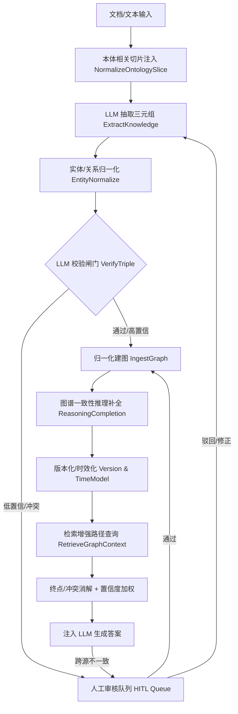

# GoTaskAI 知识库修正技术方案

> 阶段三交付物。基于阶段二选型结论（「A+D 为主、C 为深度增强、B 为高价值兜底」），结合本系统现有技术架构（Go + DeepSeek LLM + Milvus 双路召回 + Neo4j 图谱 + Asynq Worker + DashScope rerank）与实测数据规模，设计一套**完整、可落地**的知识库修正方案，涵盖修正流程框架、核心技术模块实现路径、质量管控机制、资源投入规划与风险应对措施。阶段四将据此开展小范围试点验证。

---

## 一、业务场景与需求分析

### 1.1 核心业务场景
本系统是 GraphRAG 知识库引擎，面向文档型知识库（RAG 向量侧）与图谱化知识库（KAG 图谱侧）。核心消费链路为：用户提问 → 双路召回（Milvus dense+sparse / Neo4j 图谱）→ 上下文注入 → LLM 生成答案。知识库质量直接决定答案的准确率、可信度与一致性。

### 1.2 质量需求（来自阶段一实测）
| 需求 | 现状（实测） | 缺口 |
|---|---|---|
| **准确率**：答案与事实相符 | 合成集 100%；开放域 WikiHop 40%，KAG +0.0pp | 开放域事实召回不足（60% 漏答） |
| **完整性**：图谱覆盖足够、关系不碎片化 | 2338 关系 / ~350+ 关系类型，每种仅 1~2 次 | 关系 schema 爆炸、三元组稀疏 |
| **一致性**：跨源/跨检索不矛盾 | 多跳返回中间层级实体（`Taguig City` 而非 `capital region`），RAG/KAG 无冲突消解 | 逻辑冲突、无终点约束 |
| **时效性**：知识不陈旧 | Document 无 `UpdatedAt`/version；图谱 `MERGE` 只增不改 | 无时效/版本管理 |
| **准确性护栏**：错误不注入 | 抽取→直接建图，无校验 | 无质量闸门 |

### 1.3 数据规模（存量与增长）
- 向量侧：单 KB 文档→切块（ChunkSize 500 / Overlap 50）→ Milvus `kb_chunks`。
- 图谱侧：`IngestGraph` 全量累加 `MERGE`，当前遗留图谱约 **1863 节点 / 2338 关系**。
- 并发：Worker 5 × 2 进程 = 10 并发；预算 `MaxCallsPerTask=15`、`MaxTotalCallsPerTask=30`。
- **质量要求定位**：面向"文档知识库 + 图谱"混合场景，需在不显著增加成本前提下闭合抽取→校验→建图→检索→审核链路。

---

## 二、修正流程框架（总体架构）

总体修正流程采用「**抽取前归一化 → 抽取 → 校验闸门 → 归一化建图 → 推理补全 → 人工兜底 → 版本化**」七段式闭环。相比现状（抽取→直接建图），新增了归一化、校验、补全、审核、版本化五道闸口。

**与现状的差异（逐级定位）**：
- B 填充 `ExtractKnowledge` 无本体约束的缺陷（[kag.go L38-L44](file:///d:/Program%20Files/GoTaskAI/internal/pkg/kag/kag.go#L38-L44)）。
- D 填充 `cleanRelationName` 仅大写化关系名、未规范化实体名、未收敛关系语义的缺陷（[kag.go L262-L268](file:///d:/Program%20Files/GoTaskAI/internal/pkg/kag/kag.go#L262-L268)）。
- E 填充"抽取后直接写库"无质量闸门的缺陷（[rag.go L84-L96](file:///d:/Program%20Files/GoTaskAI/internal/api/rag.go#L84-L96)）。
- J/K 填充 `RetrieveGraphContext` 一步生成、无终点约束的缺陷（[kag.go L99-L170](file:///d:/Program%20Files/GoTaskAI/internal/pkg/kag/kag.go#L99-L170)）。
- I 填充 Document 无版本/时效的缺陷（[document.go L6-L15](file:///d:/Program%20Files/GoTaskAI/internal/model/document.go#L6-L15)）。

### 2.1 目标质量标准（预设）
| 维度 | 质量门 | 目标值 | 当前值 |
|---|---|---|---|
| 准确率 | 开放域事实召回（宽松） | ≥ 70% | 40% |
| 准确率 | 开放域严格（exclusivity 适格题型） | ≥ 55% | ~0% |
| 错误注入 | 多跳返回"中间层级/干扰"率 | ≤ 1/20 | 3/20 |
| 完整性 | 规范关系类型数量 | ≤ 120 | ~350 |
| 完整性 | 长尾关系（出现 1 次）占比 | ≤ 40% | ~70% |
| 一致性 | 实体误合并率 | 0 容忍 | 未检测（风险高） |
| 一致性 | 检索"恒空"题率 | ≤ 5% | 多题恒空 |
| 时效 | 三元组带 version/valid_from 覆盖率 | 100% | 0% |

---

## 三、核心技术模块实现路径

### 模块 1：实体/关系归一化与本体收敛（路线 D，T0）

**目标**：根治"实体名大小写/空格不一致致精确匹配空返回"与"关系 schema 爆炸"。

#### 1.1 实体归一化（新增 `EntityNormalize`）
- **规范化键 `norm_name`**：去首尾空白、折叠大小写、Unicode NFKC 归一、移除多余空格/连字符、编号/缩写别名映射。建图节点新增属性 `norm_name`，作为实体唯一身份键。
- **检索侧对齐**：`RetrieveGraphContext` 生成的 Cypher 从 `{name:$x}` 精确匹配升级为 `{norm_name: $normalized}`，或 `name = $x OR norm_name = $normalized`。
- **强制：规范化键唯一**：同一 `norm_name` 只允许一个实体节点（`MERGE (a:Entity {norm_name: $norm})`），杜绝同名多节点。

#### 1.2 关系归一化与语义等价类（升级 `cleanRelationName`）
- 保留大小写折叠为**小写**（与现状强制大写不同，改为统一小写更贴近 LLM 生成习惯，见实测结论 Bug 1）；仍剥离非法字符、数字开头加前缀。
- 新增**关系语义等价类映射表** `relation_synonyms`：如 `headquarters_in / headquartered_in / located_in → located_in`，在抽取与 Text2Cypher 两侧统一收敛。
- **本体白名单**：维护领域规范关系集（如 ≤120 个），抽取与 Cypher 生成均限定在此白名单内。

#### 1.3 本体引导抽取（升级 `ExtractKnowledge`）
- 借鉴"本体引导抽取">：从图库/本体内嵌库按相似度检索与当前文本相关的**关系/实体类型切片**，注入抽取 prompt，约束 LLM 只产出白名单内关系（减少 94% 目录开销）。
- 复用现有 Milvus + `text-embedding-v4`（1024 维）承载 `relation_schema` / `entity_type` 嵌入集合。

### 模块 2：LLM 校验闸门（路线 A，T0）

**目标**：补"无质量闸门"，拦截错误三元组。

#### 2.1 三元组真伪/一致性校验（新增 `VerifyTriple`）
- 对每条三元组 `(s, r, o)` 做**判别式判定**：给定原文证据片段 + 三元组，LLM 输出结构化判定 `{verdict: support|contradict|unknown, confidence: 0-1, reason}`。
- **成本控制**：在线闸门用云端 DashScope `qwen3-rerank`（低本、快，复用现有百炼 key 与 `internal/pkg/rerank` 客户端）做初筛；高价值/边界证据（confidence ∈ (0.4, 0.8)）升级到 DeepSeek `deepseek-v4-pro` 复核。
- **不做无证据自纠错**（source 领域共识：无外部反馈的自纠错会退化）——校验必须绑定原文证据，而非"让 LLM 自己检查"。

#### 2.2 置信度路由
- `confidence ≥ T_high`（如 0.9）→ 自动放行建图。
- `T_low < confidence < T_high`（如 0.4~0.9）→ 进入人工审核队列（模块 4）。
- `confidence ≤ T_low` → **拦截**，不写库；记录到质量报告。

### 模块 3：多跳路径规划与证据可靠性加权（路线 C，T1）

**目标**：根治"KAG 返回中间层级实体、无终点约束"。

#### 3.1 Schema 感知逐跳路径规划（升级 `RetrieveGraphContext`）
- 由"LLM 一步生成单条 Cypher"升级为「**起点实体定位 → 按关系白名单逐跳展开 → 终点类型/问题约束校验**」。
- 生成候选路径后，对每条路径做**终点满足性检查**：是否命中问题要求的目标类型/终态（否则视为中间层级，不注入为答案）。
- 约束注入 `knownRelationTypes`（[kag.go L217-L242](file:///d:/Program%20Files/GoTaskAI/internal/pkg/kag/kag.go#L217-L242)）与关系语义等价类。

#### 3.2 证据可靠性评分
- 每条多跳证据带 `reliability = f(规则置信度, 路径一致性, 类型有效性, 支持度)`（借鉴规则增强补合思想）。
- 无过滤的多跳证据会**损害性能**（生产验证结论），故仅采纳 `reliability ≥ 阈值` 的路径，并据此排序/截断，剔除干扰候选与中间实体。

### 模块 4：人机协同审核（路线 B，T1）

**目标**：对机器低置信/冲突/高风险样本兜底，保住准确率上限。

#### 4.1 审核队列与工具
- 复用 Asynq 队列承载审核任务；前端可自研简易审核 UI 或接入 **Label Studio**（开源自托管，支持预标注导入 + QA + 多人标注）。
- 任务分解为微任务：先 NER 确认实体，再判定关系正确性，降低认知负荷。

#### 4.2 质量控制
- **金标准测试（golden set）**：抽检审核员准确率；**共识评分**：≥3 人多数决；**裁定（adjudication）**：分歧仲裁。
- **置信度路由**：仅低置信/冲突样本进人工，控制人力成本。

#### 4.3 铁律（源自生产级 KG 教训）
> **实体合并是破坏性且不可检测的**：两个记录一旦合并、属性并集，将无法拆分且不报错。因此——
> - 仅当 `norm_name` 规范化键**完全相等**时才自动合并。
> - 凡属模糊匹配/语义相近，一律只**打候选标（suggest merge）**交由人工/LLM 判定，**绝不在任何置信度阈值下自动永久合并**。

### 模块 5：版本/时效模型与向量-图谱对账（贯穿所有路线）

**目标**：根治"文档无时效、图谱只增不改、向量图谱异源无对账"。

#### 5.1 数据模型扩展
- `Document`（[document.go](file:///d:/Program%20Files/GoTaskAI/internal/model/document.go)）新增：`Version`、`UpdatedAt`、`SourceTimestamp`、`ContentHash`。
- 图谱三元组/节点新增：`confidence`、`valid_from`、`valid_until`、`source`、`norm_name`、`version`。
- 提供 `expire`（`valid_until` 到期软删除/归档）与 `supersede`（新版本覆盖旧版本并保留历史）。

#### 5.2 向量-图谱一致性对账
- Milvus 侧与 Neo4j 侧由**不同链路**构建（[pool.go L809-L899](file:///d:/Program%20Files/GoTaskAI/internal/worker/pool.go#L809-L899) 文档构建 vs [rag.go L84-L96](file:///d:/Program%20Files/GoTaskAI/internal/api/rag.go#L84-L96) KAG 建图），当前**互相对账**缺失。
- 新增**对账任务**：以 `doc_id/kb_id` 为键比对两侧覆盖情况，发现"向量侧有、图谱侧无（或反之）"即触发补建/告警，确保双路一致。

---

## 四、质量管控机制

### 4.1 三层质量闭环
| 层级 | 时机 | 手段 | 指标 |
|---|---|---|---|
| 构建期 | 抽取→建图 | 模块1归一化 + 模块2 校验闸门 | 校验通过率、拦截率、误合并(0) |
| 检索期 | 查询→注入 | 模块3 终点校验 + 置信度加权 + 冲突消解 | 空返回率、正确终点率、中间层级率 |
| 运营期 | 在线/离线 | 模块4 人工审核 + 模块5 版本化 + 数据集持续评测 | 准确率、审核一致性、时效覆盖率 |

### 4.2 关键质量指标（KQI）与采集
- **事实准确率**：公开数据集（WikiHop/MedHop）+ 内部评测集定期回归，`tools/wikihop_eval` 可复用扩展。
- **实体消解质量**：误合并率、规范化键唯一性校验（Neo4j 唯一约束 + 对账）。
- **关系收敛度**：规范关系类型数、长尾占比（`CALL db.relationshipTypes()` 统计，即 `knownRelationTypes` 数据源）。
- **时效覆盖**：三元组 `version/valid_from/confidence` 覆盖率。
- **成本**：每个新增模块的 LLM 调用/token/成本纳入现有 `llm.Budget` 计量（[budget.go](file:///d:/Program%20Files/GoTaskAI/internal/pkg/llm/budget.go)）。

### 4.3 质量门禁（Fail-safe）
- 校验不通过 ⇒ 不写库（并非"近似可用"入库）；宁可缺失，不可污染。
- 多跳终点不满足 ⇒ 不注入为答案（避免中间层级误导下游）。
- 一切自动合并以规范化键完全相等为前提；模糊合并降级为候选标，防止破坏性、不可检测的错误。

---

## 五、资源投入规划

### 5.1 研发投入（按模块）
| 模块 | 工程量 | 新增依赖 | 责任人角色 |
|---|---|---|---|
| 模块1 归一化+本体 | 中 | 内嵌模型（复用 `text-embedding-v4`） | Go 后端 + 领域建模 |
| 模块2 LLM 校验闸门 | 中 | 复用 DeepSeek/DashScope | Go 后端 + prompt 工程 |
| 模块3 多跳路径规划 | 高 | Neo4j GDS（可选） | Go 后端 + NLP/图算法 |
| 模块4 人工审核 | 中 | Label Studio 或自研 UI | 前端 + 后端 |
| 模块5 版本/对账 | 中 | 无（框架内） | Go 后端 + DBA |

### 5.2 模型/算力投入
- **新增 LLM 调用**：校验、路径规划、审核均为增量调用。按 DeepSeek 单价（in=0.27$/1M、out=1.10$/1M）单条校验 < 0.001 美分；全量校验成本可控。避免大规模 Self-Consistency（×5~20 成本），仅用于高价值样本。
- **嵌入**：复用现有 `text-embedding-v4`（1024 维），零新增模型。在线闸门复用云端 DashScope `qwen3-rerank`（已有 `internal/pkg/rerank` 客户端），无需新增本地模型。
- **存储**：Neo4j 新增属性与唯一约束；Milvus 新增 `entity_emb`/`relation_schema` 小集合，量级可控。

### 5.3 人力资源投入
- 初期（T0）聚焦模块1+2+5，1~2 名后端 + 0.5 名领域建模即可落地。
- 人工审核（模块4）为运营成本，仅低置信/冲突样本触发，占比低；通过金标准 + 共识控制人力。

---

## 六、风险应对措施

| 风险 | 等级 | 影响 | 应对 |
|---|---|---|---|
| **实体错误合并（破坏性且不可检测）** | **Critical** | 污染图谱、无可追踪错误 | 仅规范化键完全相等才自动合并；模糊匹配只打候选标；实体消解误合并率设 0 容忍门禁 |
| **自纠错/自校验退化**（无外部证据） | High | LLM 校验失真 | 校验必须绑定原文证据；判定器与生成器分离；用判定稳定性（多深度/多模型）而非单一自检 |
| **多跳伪路径降低性能** | High | KAG 反而更差 | 多跳证据带可靠性评分，无过滤不采纳；终点类型/约束校验剔除中间实体 |
| **关系 schema 仍爆炸/长尾** | Medium | 收敛失败 | 本体白名单 + 关系语义等价类 + 本体引导抽取，设收敛目标（≤120），滚动统计校准 |
| **成本失控**（新增 LLM 调用） | Medium | 预算超限 | 复用 `llm.Budget` 计量；置信度分层路由；避免全量 Self-Consistency；低价值样本用便宜模型 |
| **人工审核成本/质量不均** | Medium | 兜底失效 | 仅低置信/冲突样本进人；金标准抽检 + 共识评分 + 裁定 |
| **向量-图谱不一致** | Medium | 双路检索矛盾 | 新增对账任务按 `doc_id/kb_id` 比对两侧覆盖，不一致触发补建/告警 |
| **MedHop 未评测，实体关联缺陷缺乏量化** | Low-中 | 验证不充分 | 阶段四在 MedHop（实体为掩码 ID，实体关联黄金语料）上补测，量化关联修复收益 |

---

## 七、本方案可落地性自评

1. **链路闭合**：抽取前归一化 → 校验 → 建图 → 补全 → 审核 → 版本化 → 检索，七段闭环，每步都有明确代码落点（见第二章差异定位）。
2. **组件增量**：不更换现有技术栈（Go/DeepSeek/Milvus/Neo4j/Asynq/DashScope 全沿用），新增逻辑以**模块化函数 + 复用现有基础设施**为主，改动面可控。
3. **成本可控**：所有新增均为渐进式 LLM 调用，复用 `llm.Budget` 计量；嵌入零新增模型。
4. **铁律清晰**：针对生产级知识图谱最容易踩的"破坏性错误合并"，本方案明确了"规范化键完全相等才合并 + 模糊匹配仅候选标"的不可妥协原则。

> 风险与缺口：模块3（多跳路径规划）工程量最高，建议作为 T1 在模块1/2 生效后再引入，否则在 schema 未收敛、实体未对齐的情况下，多跳推理仍会失败（阶段一已证实"KAG 价值与图谱质量强绑定"）。

---

## 八、阶段四待验证项（试点范围）

本方案将在阶段四进行**小范围试点**，试点聚焦 T0 能力（模块1 归一化 + 模块2 校验），在公开数据集上验证修正效果：
1. **归一化修复**：对阶段一实测失败的样本（如 `solva sawan`、`danish general election`、`upper bicutan national high school`）重跑检索，验证"空返回→命中"的改善。
2. **关系收敛**：统计修复后规范关系类型数与长尾占比是否显著下降并接近目标（≤120）。
3. **失效样本回归**：WikiHop 20 样本重测，对比修正前后宽松/严格准确率与"错误命中率"。
4. **MedHop 补测**：量化"实体关联错误"维度的修复收益。
5. **成本/延迟回归**：核算新增校验/归一化的 LLM 调用与 token 增量。

试点将输出前后对比数据，据此优化方案细节（阈值、白名单规模、路由策略），并汇总为最终《知识库修正技术方案（含架构图/实施路线图/评估指标体系）》。
