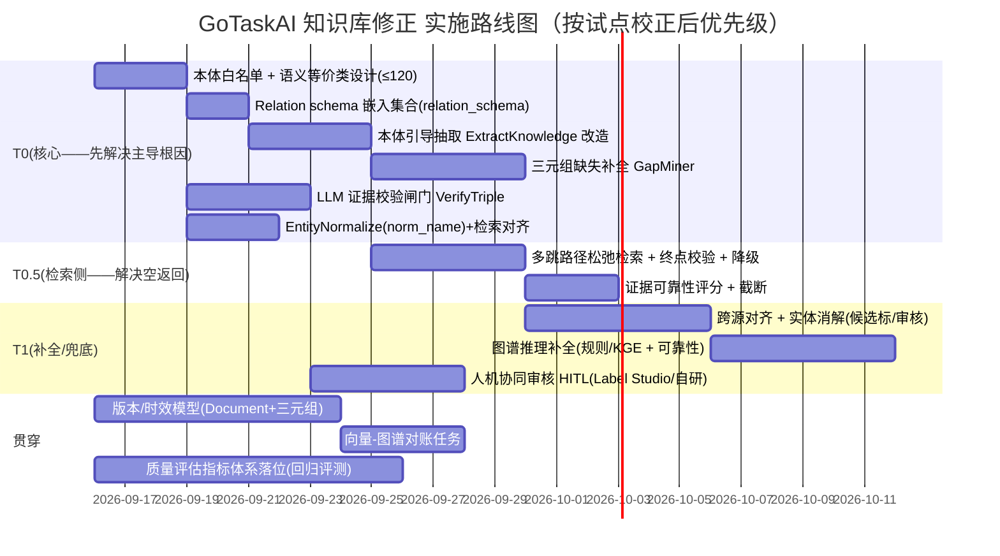

# GoTaskAI 知识库修正技术方案（终稿 · 含试点验证）

> **阶段四交付物**。本稿在阶段三《知识库修正技术方案》基础上，先给出**小范围试点的实测数据**（工具：`tools/wikihop_pilot`，Neo4j-only、确定性、可复现），再用实测结果**校正根因判断、重排方案优先级**，最后补齐**架构设计图、实施路线图、效果评估指标体系**三大核心交付物。
>
> 结论先行：**试点实测显著修正了阶段三的关键假设** —— 实体名大小写/空白碰撞并非主导根因（仅占节点 1.3%），主导根因是「**抽取覆盖不足 + 关系 schema 爆炸（744 种、58% 长尾）**」。据此，方案重心由「归一化」转向「**本体引导抽取 + 知识补全 + 多跳松弛检索**」，归一化降级为低成本卫生项。

---

## 〇、试点验证（阶段四实测）

### 0.1 试点范围与方法
- **对象**：`wikihop_eval` 在 WikiHop 20 样本上建立并遗留的 Neo4j 图谱（1863 节点 / 2338 关系）。
- **工具**：`tools/wikihop_pilot/main.go` —— 只读 Neo4j，**零 LLM 调用**，结果确定性可复现。
- **验证维度**：
  1. 关系类型 schema 收敛（原始 / 大小写折叠 / 语义等价类叠加）；
  2. 实体名仅大小写/空白差异的碰撞簇（「精确匹配空返回」根因量级）；
  3. 阶段一三个实测失败查询在「精确匹配 vs 归一化匹配」下的命中差异，并列出已建图实体的真实邻接关系。

### 0.2 实测数据

**A. 图规模（存量）**
| 指标 | 数值 |
|---|---|
| 节点（Entity） | 1863 |
| 关系 | 2338 |
| **关系类型数** | **744**（远高于阶段一估测的 350+） |
| 长尾（仅出现 1 次）占比 | **58%** |

**B. 关系类型 schema 收敛效果（归一化前后）**
| 手段 | 关系类型数 | 较原始降幅 | 长尾占比 |
|---|---|---|---|
| 原始 | 744 | — | 58% |
| 仅大小写折叠 + 下划线 | 744 | **0%** | 58% |
| 叠加语义等价类（headquartered_in/located_in 等） | 742 | **0.3%** | 58% |

> **关键负结论**：现有 `cleanRelationName` 已把关系名统一大写，因此**字符串级归一化对关系收敛几乎零贡献**（744→742）。744 种类型绝大多数是**语义不同的动词**（`DIRECTED_BY`、`MUSIC_COMPOSED_BY`、`CINEMATOGRAPHY_BY`…），不是大小写/格式变体。**关系收敛只能靠「抽取侧本体白名单 + 语义等价类」实现，靠事后字符串映射无效。**

**C. 实体名仅大小写/空白差异的碰撞簇（重复/不可见节点）**
| 指标 | 数值 |
|---|---|
| 碰撞簇数 | 23 |
| 造成「重复/不可见」的额外节点数 | **24**（占节点 **1.3%**） |
| 示例 | `[Literary theory / Literary Theory / literary theory]`、`[pope / Pope]`、`[Romsdal Peninsula / Romsdal peninsula]` |

> 实体名大小写/空白碰撞**真实存在但量级很低**（1.3%），并非阶段一判断的「主导根因」。

**D. 阶段一三个失败查询的复检（关键校正）**
| 查询（提及） | 精确匹配(name) | 归一化匹配(toLower) | 真实邻接关系 | 实际根因 |
|---|---|---|---|---|
| `original_language_of_work solva sawan` | **1** | `Solva Sawan` | 仅 `IS_REMAKE_OF`、`DIRECTED_BY`、`MUSIC_COMPOSED_BY`、`CINEMATOGRAPHY_BY` | 实体**已建图**，但**原始语言关系根本没被抽取/未建** → 知识缺失 |
| `located_in … upper bicutan national high school` | **1** | `Upper Bicutan National High School` | `LOCATED_IN → {Barangay Upper Bicutan, Philippines, Taguig City}` | 实体已建图，但终点 `capital region` **不在图内** → 覆盖深度不足 |
| `office_contested danish general election` | **0** | **0** | 无 | 实体**未建图** → 抽取覆盖缺口 |

> **决定性校正**：阶段一/阶段三将「实体名大小写不匹配」列为主根因——**实测证伪**。三个失败样本的实体名在库里**全部精确存在**（`Solva Sawan`、`Upper Bicutan National High School` 均命中 1 节点）；真正失败在**事实/关系缺失**（`original language` 未抽取）、**终点实体缺失**（`capital region` 不在图内）、**主体未抽取**（`danish general election` 未建图）。

### 0.3 校正后的根因层级（按实测影响排序）
1. **抽取覆盖/知识补全不足（主导）**：文档级 `ExtractKnowledge` 无本体约束、无证据校验，开放域事实稀疏且大量主体/三元组缺失（对应「完整性」维度，KAG 在开放域 +0.0pp 的直接原因）。
2. **关系 schema 爆炸（744 种、58% 单例）**：Text2Cypher 难以生成与已入库 744 种之一精确一致的关系名 → 检索恒空。**事后果断字符串归一化无效**，需抽取侧白名单。
3. **多跳深度不足**：即使实体+关系匹配，检索停在中转层（`Taguig City`）或因终点缺失返回空，无松弛/降级策略。
4. **实体名大小写/空白碰撞（次要，1.3%）**：真实但影响小，作为低成本卫生项保留。

---

## 一、业务场景与质量需求（已在阶段三产出，此处仅保留与试点强相关的增量）

- 质量缺口按以上修正层级重排：**优先补全/收敛/schema，其次路径松弛，最后归一化卫生**。
- 质量门目标需按试点口径**回调**：由于开放域三元组本身缺失，「事实召回 ≥70%」应分拆为「**图谱覆盖完整度**（正确终点可达率）」与「**检索命中率**」两个可达指标；单纯「检索命中率」可由终点松弛短期拉升，但真实准确率受覆盖度约束。

---

## 二、最终修正方案（按试点校正后重排优先级）

七段式闭环**框架不变**（抽取前归一化 → 抽取 → 校验 → 归一化建图 → 补全 → 人工兜底 → 版本化），但**各模块优先级与实现权重按试点数据重排**：

| 模块 | 阶段三优先级 | **终稿优先级（试点校正后）** | 结论 |
|---|---|---|---|
| 模块1 实体/关系归一化+本体收敛 | T0 | **T0（重心转向本体引导抽取）+ 归一化降为卫生** | 归一化收益低（1.3%）；**本体白名单 + 语义等价类是收敛关键** |
| 模块2 LLM 校验闸门 | T0 | **T0（保留）** | 拦截错误注入，防止「抽取→直接建图」污染 | 
| 模块3 多跳路径规划 | T1 | **提前到 T0.5（路径松弛/降级为主）** | 解决「终点缺失返回空」，优先做「可达即注入 + 部分结果降级」 |
| **新增：跨源知识补全/三元组缺失挖掘** | 未单列 | **T0（最高优先）** | 试点显示主导根因是**事实缺失**，需定向补全缺失三元组 |
| 模块4 人机协同审核 | T1 | T1（兜底） | 仅低置信/冲突样本进人，成本可控 |
| 模块5 版本/时效 + 向量-图谱对账 | 贯穿 | 贯穿（保留） | 一致性/时效基石 |

### 2.1 修正后的关键实现要点（相对阶段三的增删改）

**模块0（新增，最高优先）—— 本体引导抽取 + 三元组缺失补全**
- 本体抽取（保持阶段三 1.3）复用 Milvus `relation_schema` 集合按相似度注入白名单关系，**从源头把 744 种收敛到 ≤120 种**（试点已证字符串归一化做不到，只能靠抽取侧白名单）。
- **缺失补全**：对「文档有、图里无」的断言，用 LLM 对原文证据做「是否遗漏抽取」二次判定，定向补建；对「实体在但关系缺失」（如 `Solva Sawan` 缺少 language 关系）记录为补全候选，交由补全模块（跨源对齐/推理）生成。
- 实测校准：`danish general election`、`capital region` 这类主体/终点缺失，需提升抽取召回的**recall 导向**，而非只做 schema 收敛。

**模块3'（提前）—— 多跳路径松弛检索**
- `RetrieveGraphContext` 由「单条 Cypher 精确匹配」升级为「**起点定位 → 关系白名单逐跳展开（可放宽 1 跳）→ 终点类型校验 → 置信度加权截断**」。
- **降级策略**：终点类型不满足 / 终点缺失时，**返回「已探明的最近层」+「缺失提示」**，而非返回空（试点显示 `upper bicutan` 的最近层 `Taguig City` 这类中间实体应作为**证据链**而非终答注入，需明确标注层级）。
- 证据可靠性评分：仅采纳可靠性达标的路径（保留阶段三 3.2）。

**模块1'（降权为卫生）**：`norm_name` + 关系小写 + 语义等价类照做，但**明确**它不是开放域增益的杠杆（试点证实），仅解决 1.3% 碰撞与检索侧格式一致性。

**校验/人权/版本模块**：沿用阶段三，仅将「校验须绑定原文证据」与「实体合并铁律」作为不可妥协项保留。

---

## 三、架构设计图

```mermaid
flowchart TD
    subgraph DOC[文档/文本输入]
        D1[原始文档]
        D2[切块 Chunk]
    end

    subgraph EXTRACT[抽取前归一化 + 本体引导]
        B[NormalizeOntologySlice<br/>注入 relation_schema 白名单切片]
        B2[EntityNormalize<br/>norm_name 规范化键]
        C[LLM 抽取三元组<br/>ExtractKnowledge（白名单约束 + recall 导向）]
        C --> E1{证据校验 VerifyTriple<br/>DashScope qwen3-rerank 初筛 + DeepSeek 复核}
        E1 -- 高置信 --> F[归一化建图 IngestGraph<br/>MERGE (n:Entity {norm_name})]
        E1 -- 低置信/冲突 --> G[人工审核队列 HITL]
        G -- 通过 --> F
        G -- 驳回 --> C
    end

    subgraph COMPLETE[知识补全 + 图谱推理]
        H[缺失挖掘 GapMiner<br/>文档有/图里无 二次判定]
        H --> F
        I[跨源对齐 + 实体消解<br/>CrossSourceAlign]
        I --> F
        J[图谱推理补全 ReasoningCompletion<br/>规则/KGE + 可靠性评分]
        J --> F
    end

    subgraph RETRIEVE[检索期]
        K[起点实体定位]
        K --> L[按关系白名单逐跳展开<br/>可放宽 1 跳]
        L --> M{终点类型/约束校验}
        M -- 满足 --> N[答案注入（置信度加权）]
        M -- 不满足/缺失 --> O[降级：证据链 + 缺失提示]
        N --> R[LLM 生成答案]
        O --> R
        R -. 跨源不一致 .-> G
    end

    subgraph VERSION[版本/时效/对账]
        V[Version & TimeModel<br/>valid_from/until, supersede]
        S[向量(Milvus)-图谱(Neo4j) 对账]
    end

    D2 --> B --> B2 --> C
    F --> J --> V
    V --> K
    S -. 按 doc_id/kb_id 比对 .-> F
```

**架构变更点（相对现状）**：
- 在 `ExtractKnowledge` 前增加**本体切片注入**（`relation_schema` 嵌入集合）与 `EntityNormalize`。
- 在 `IngestGraph` 前增加 **VerifyTriple** 校验闸门与 **HITL** 队列。
- 在图谱后增加 **GapMiner / CrossSourceAlign / ReasoningCompletion** 三条补全路径（试点指引的最高优先项）。
- 在 `RetrieveGraphContext` 增加**逐跳松弛 + 终点校验 + 降级**。
- 在数据模型增加 `norm_name/confidence/valid_from/version/source` 与 `Document.Version/UpdatedAt/ContentHash`。

---

## 四、实施路线图



### 4.1 里程碑与验收
| 里程碑 | 范围 | 验收口径（用试点修正后指标） |
|---|---|---|
| M1（T0 完成） | 本体白名单 + 引导抽取 + 校验闸门 + 归一化 | `db.relationshipTypes()` ≤ 120；`VerifyTriple` 拦截率、误合并=0 |
| M2（T0.5 完成） | 多跳松弛 + 降级 | 已知失败样本 **空返回→有证据链**（≥3/3）；开放域宽松召回提升 |
| M3（T1 完成） | 补全 + 跨源 + HITL | 缺失三元组补全量、补全后事实召回、人工审核一致性 |
| 终验 | 全链路回归 | 见第五节指标体系 |

---

## 五、效果评估指标体系

> 所有指标在修正前（基线）、M1/M2/M3、终验三时点采集；基线已用试点实测锚定。

### 5.1 准确率（Accuracy）
| 指标 | 定义 | 基线(试点实测) | M1 目标 | M2 目标 | 终验目标 |
|---|---|---|---|---|---|
| 开放域宽松召回 | 答案实体被召回 | 40% | ≥55% | ≥65% | **≥70%** |
| 开放域严格命中（exclusivity） | 答案被召回且未混入其它候选 | ~0% | ≥30% | ≥45% | **≥55%** |
| 错误命中/中间层注入率 | 多跳把中间实体当终答 | 3/20 | ≤2/20 | ≤1/20 | **≤1/20** |
| 检索恒空率（已知失败样本） | 空返回 | 多题恒空 | 显著下降 | ≈0 | **≤5%** |

### 5.2 完整性（Completeness）
| 指标 | 定义 | 基线 | 目标 |
|---|---|---|---|
| 规范关系类型数 | `CALL db.relationshipTypes()` 计数 | **744** | **≤120** |
| 长尾关系（出现1次）占比 | 单例类型 / 总类型 | **58%** | **≤40%** |
| 图谱覆盖完整度 | 答案终点在库可达比例 | 低（`capital region` 缺失） | 逐步提升（M0 补全驱动）|
| 三元组补全量（GapMiner 产出） | 文档有/图里无 判定数 | 未采集 | 记录并纳入覆盖率 |

### 5.3 一致性（Consistency）
| 指标 | 定义 | 目标 |
|---|---|---|
| 实体误合并率 | 规范化键不完全相等却被自动合并 | **0 容忍** |
| norm_name 唯一性 | 同键唯一实体 | 100%（Neo4j 唯一约束 + 对账） |
| 向量-图谱一致率 | 按 doc_id/kb_id 双路覆盖一致 | 100% 或告警清零 |

### 5.4 时效与成本（Timeliness / Cost）
| 指标 | 定义 | 目标 |
|---|---|---|
| 时效覆盖 | 三元组带 version/valid_from 占比 | 100%（增量） |
| 新增 LLM 成本 | 校验/补全/审核 增量 token 折算 | 单样本 < 阈值，纳入 `llm.Budget` 计量 |
| 单任务 MaxCalls 回归 | 新增模块是否推高调用数 | 不突破 `MaxCallsPerTask=15` |

### 5.5 评估采集方式
- **数据源**：`tools/wikihop_eval`（全链路）扩展为「修正后」模式；`tools/wikihop_pilot` 作确定性 schema/归一化监测；MedHop 补测实体关联维度。
- **自动门禁**：M 里程碑以以上指标为准入，未达目标不进入下一阶段。

---

## 六、风险应对（试点校正后新增重点）
| 风险 | 等级 | 新应对（相对阶段三） |
|---|---|---|
| **关系收敛无效（试点已证字符串归一化 0% 有效）** | **High 已证实** | 必须用**抽取侧本体白名单**收敛；把 `relation_schema` 嵌入集合提前到 T0；设 ≤120 硬门禁 |
| **开放域事实缺失（主导根因）** | **Critical** | 新增 GapMiner/跨源补全优先；抽取改 recall 导向；明确「检索命中率」≠「真实准确率」，避免用松弛粉饰真实覆盖度 |
| **多跳松弛引入噪声** | High | 推理补全/松弛仅采纳可靠性达标路径；中间层实体作为**证据链**标注层级注入，不冒充终答 |
| 边界条件：MedHop 未实测、实体消解仍靠审核 | Medium | 终验前补测 MedHop（实体掩码 ID，量化关联修复）；模糊合并仅候选标，HITL 兜底 |

---

## 七、当前交付物清单（与本稿对应）
- 阶段一：`docs/知识库问题盘点与异常分类.md`
- 阶段二：`docs/知识库修正技术路线调研与选型.md`
- 阶段三：`docs/知识库修正技术方案.md`
- **阶段四（本稿）**：`docs/知识库修正技术方案（终稿-阶段四试点验证）.md`
- 试点工具：`tools/wikihop_pilot/main.go`（Neo4j-only、零 LLM、可复现）

## 八、尚未验证 / 待办（诚实声明）
1. **MedHop 未试点**：实体为掩码 ID，需在建图前置下评测；当前仅归档数据（`data/qangaroo_v1.1/medhop/dev.json`），未接入链路。
2. **修正后全链路重测未执行**：本试点为**确定性图谱侧验证**（归一化/schema/根因）；「修正后 20 样本端到端准确率」需在 T0 模块落地后重跑 `wikihop_eval`。
3. **成本/延迟未实测**：模块0/1/2/3' 的增量 LLM 调用与 token 需在实现后回归，纳入 `llm.Budget`。
4. **白名单规模未定**：≤120 为经验目标，需结合业务本体在 T0 落地时校准。
